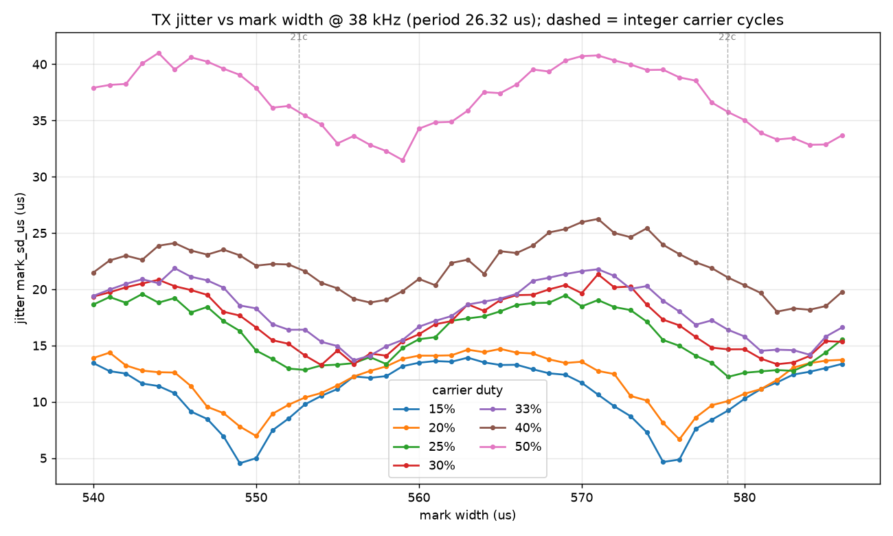
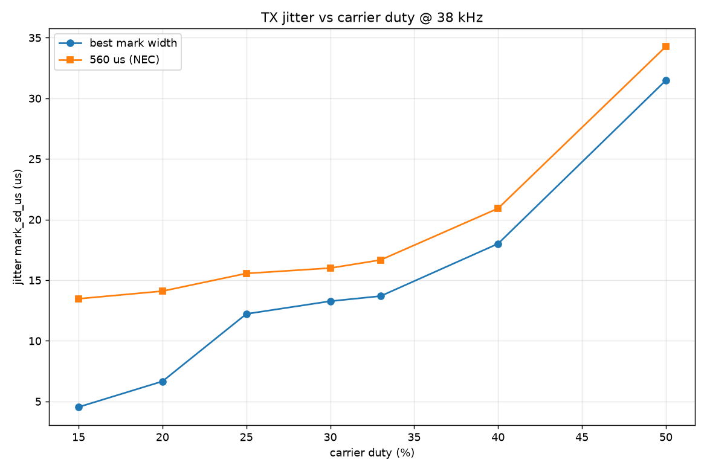
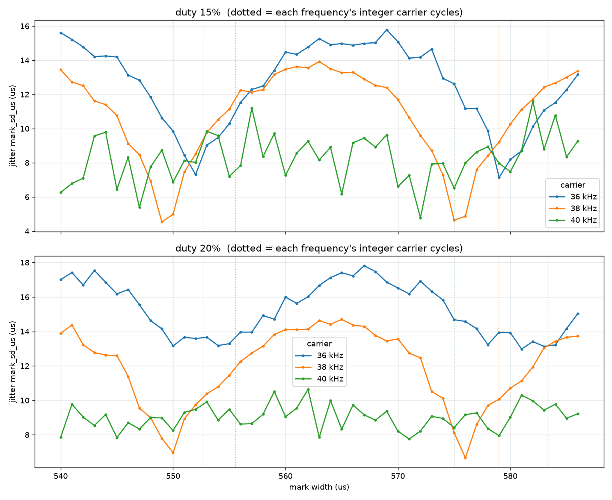

# キャリア / マーク幅 ジッター プローブ

> English: [README.md](README.md)

**IRキャリア（周波数・デューティ）とマーク幅の関係**が、TSOP復調後のエッジ
ジッターにどう効くかを直接調べるリグです。送信・受信とも**生RMTを1µs単位**で
扱います。

- **TX（peer_tx/）**: `rmtInit(.., RMT_TX_MODE, .., 1MHz)` ＋ `rmtSetCarrier()` で
  NEC形のフレーム（9000/4500ヘッダ＋32ビットマーク＋stopマーク）を送信。ペイロードは
  任意（マークしか見ない）。**ビットマーク幅・キャリア周波数・デューティ**を可変。
- **RX（carrier_jitter.ino）**: `tx_jitter/` と同じ1µs RMTキャプチャ。各エッジ幅を
  `RX_JITTER` で出力。
- 経路は **IR LED → 空中 → TSOP**（`tx_jitter/` と同じ2台配線）。キャリア復調の効果を
  見るのが目的なので、有線ループバックではなく TSOP 経由が必須です。

## なぜ

38kHz の周期は `1e6/38000 = 26.316µs`。NEC の 560µs マークは `560/26.316 = 21.28`
周期で**半端に終わる**ため、TSOP が最後のパルスをマークに数えるか否かがフレームごとに
ゆらぎ、復調エッジが ±1キャリア周期ぶれます。一方、整数周期に近い幅
（`21 × 26.316 = 552.6µs`、≒553µs）は**サイクル境界で終わる**ので安定するはず。
このリグで「マーク幅 vs ジッター」を測り、**553µs と 560µs の差**を定量化します。

## 配線

`tx_jitter/` と同じ。TX 基板の `TEST_IR_TX_GPIO`（IR LED）→ RX 基板の
`TEST_IR_RX_GPIO`（TSOP）。`.env` のキーをそのまま使います。

## 実行

```sh
cd tests
# 粗い傾向（既定: 38kHz、duty 20/33/50、mark 540..580、各20フレーム）
uv run --env-file .env pytest -s hardware/carrier_jitter/

# 細かく（例: 549..556 を 1µs 刻み、duty 33 のみ、各60フレームできれいなグラフ用）
CARRIER_MARKS="549,550,551,552,553,554,555,556" CARRIER_DUTY="33" CARRIER_FRAMES="60" \
  uv run --env-file .env pytest -s hardware/carrier_jitter/
```

掃引は環境変数で上書き:

- `CARRIER_HZ`（既定 `38000`、カンマ区切りで複数可）
- `CARRIER_DUTY`（既定 `20,33,50`、％）
- `CARRIER_MARKS`（既定 `540,545,550,553,555,560,565,570,575,580`、µs）
- `CARRIER_FRAMES`（既定 `20`）
- `CARRIER_CSV`（既定 `/tmp/carrier_jitter.csv`）

## 出力

各測定点で1行（`-s` で表示）:

```text
CARRIER_PROBE hz=38000 duty=33 mark=560 cycles=21.280 frames=20 \
  mark_sd=.. mark_max_sd=.. mark_max_ptp=.. overall_mean_sd=..
```

- `cycles` — `mark / (1e6/hz)`。整数に近いほど安定するはず。
- `mark_sd` — **幅Wのマークエッジ**（偶数index・平均がmark近傍）の標準偏差の平均。
  本命の指標。
- `mark_max_sd` / `mark_max_ptp` — マークエッジ中の最悪値。
- `overall_mean_sd` — 全エッジ平均（参考）。

終了時に `CARRIER_CSV` へCSVを書き出します（列:
`carrier_hz,duty_pct,mark_us,cycles,frames,mark_sd_us,mark_max_sd_us,mark_max_ptp_us,overall_mean_sd_us`）。
これを「マーク幅 vs mark_sd（dutyごとの系列）」でプロットすればきれいなグラフになります。

## ワークフロー

1. まず既定の粗い掃引で傾向（ジッターの谷がどのマーク幅に出るか）を掴む。
2. 谷の周辺（≒552〜553µs）を1µs刻み・多フレームで再掃引し、CSVから最適幅と
   560µsとの差を定量化。
3. 必要ならキャリア周波数も振って、最適マーク幅が `整数×周期` に追従するか確認。

## 観測結果（38 / 36 / 40 kHz、TSOPは38kHz品）

代表ラン（NEC形・空中・ESP32-S3 2台）。絶対値は構成依存、見るのは相対関係です。
グラフは `data/`（`analyze.py` で再生成可）。





- **マーク幅でジッターが振動**（グラフ1）。谷は**整数サイクル幅**付近（38kHz: ~550=21c /
  ~581=22c）、山は半端サイクル（~570≈21.5c＝マーク末尾がサイクル中央で復調が最も曖昧）。
- **553µs vs 560µs**: どのデューティでも **553 < 560**（553≈21.0サイクル=谷、560≈21.28=山寄り）。
  差は低dutyで最大（15%で 553≈9.8 / 560≈13.5µs）。ただし谷の底はさらに低い幅（~549-550）。
- **デューティ依存**（グラフ2）: 本試験では**低dutyほどジッター小**（15%≈4.5µs 〜 50%≈31µs）。
- **効果はTSOPの同調周波数で最大**（compare）: 38kHzで振動が最も鋭く谷底も最小。36kHzは
  全域でベースライン高、40kHzは平坦化（off-centerで整数サイクルの谷を活かせない）。応答は非対称。

### 実用上の指針と注意

- 38kHz品を使うなら **(1) マーク幅を38kHzの整数サイクル（~550 / ~581µs）に、(2) キャリアは
  TSOP同調周波数に合わせる**のが、復調エッジを最も安定させる。NEC標準の560µsは局所ピーク寄り。
- **デューティの結論は環境依存・要注意**: 本試験は送受信を**10cm未満**に置いたため、
  TSOP側が**IR飽和**気味で「低dutyが有利」に出た可能性がある。距離が離れる/角度がつく/
  外乱光があるなど**実環境では高dutyの方が到達距離・S/Nで有利**になり、結果が逆転しうる。
  ここでの duty 傾向は**近接・無負荷の条件下の値**として読むこと。
- 「整数サイクルで谷」という幾何的効果は距離に依らず残るはずだが、最適幅の厳密値（TSOPの
  積分遅延ぶん整数点から数µsずれる）や振幅は受光強度＝距離/角度で変わりうる。
